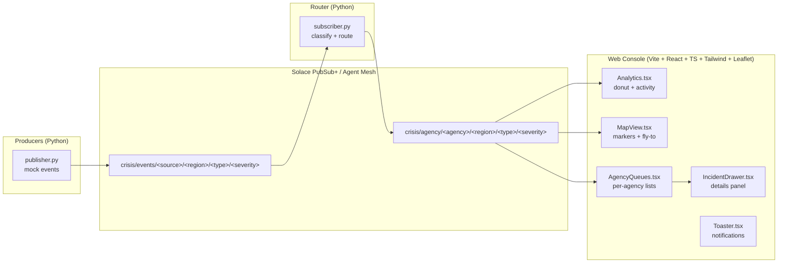

# Real-Time Incident Routing Console

## Demo

<p align="center">
  <video src="https://github.com/user-attachments/assets/e0d8b045-ef62-4d5f-acaf-c60bda7d4385" width="760" controls>
  </video>
</p>

## Overview

It’s a real-time incident prototype for **cities and large campuses**: It ingests **mock emergency alerts** and **route** them to the right agency (**Police, Firefighters, EMS, Hospitals, Transport, NGOs, …**) in **milliseconds**.

The web console shows a **live map** with incident locations, **severity analytics**, and **per-agency interactive queues**, with a details drawer for fast triage—so responders **see what matters and act immediately**. It’s built on **Solace Agent Mesh** for **reliable, low-latency** routing.

At full scale, this will ingest **real alerts** from **sensors, calls, news, and online sources**—the topic taxonomy and router are designed for that evolution.

**Under the hood (tech highlights)**

1. **Solace Agent Mesh + rules** — Per-agency topic design with rules-based enrichment/classification and **policy routing** to Police/Fire/EMS in milliseconds (secure **TCPS/WSS**).
2. **Frontend RT UI** — **React + Vite + TypeScript + Tailwind**; **Leaflet** live map; analytics; strict typing, filters, full reset logic.
3. **Debugging** — TLS trust stores, WebSocket vs. SMF URLs, strict TS errors, CI build fixes.
4. **Deployments** — Vercel builds with environment variables; mindful of serverless caveats (connections/timeouts).
5. **Event streaming** — Pub/Sub with direct topics and fan-out; Python microservices using **solace-pubsubplus**.

---

## Highlights

* Topic-based routing: `crisis/events/...` → (router rules) → `crisis/agency/...`
* Real-time UI: severity donut, 10-minute activity trend, Leaflet map, per-agency queues, details drawer
* Mock → Real: ships with mock publishers; swap real sources without UI changes
* Python microservices + TypeScript frontend; Tailwind v4 (single import), typed models, composable components

---

## Architecture



**Topic taxonomy**

* **Ingest**: `crisis/events/<source>/<region>/<type>/<severity>`
* **Routed**: `crisis/agency/<agency>/<region>/<type>/<severity>`

---

## Repo Structure

```
.
├─ src/
│  ├─ App.tsx
│  ├─ main.tsx
│  ├─ index.css                 # Tailwind v4: @import "tailwindcss";
│  ├─ components/
│  │  ├─ Analytics.tsx          # Severity donut + 10m activity
│  │  ├─ MapView.tsx            # React-Leaflet map (auto-fit, fly-to)
│  │  ├─ AgencyQueues.tsx       # Per-agency queues (click → drawer)
│  │  ├─ IncidentDrawer.tsx     # Slide-in details panel
│  │  └─ Toaster.tsx            # Minimal toast provider
│  ├─ lib/
│  │  ├─ routing.ts             # Agency routing rules/helpers
│  │  └─ solace.ts              # Browser client helpers (connect/subscribe)
│  ├─ types.ts                  # Incident & domain types
│  └─ vite-env.d.ts
├─ publisher.py                 # Mock event generator → crisis/events
├─ subscriber.py                # Router (re-publish) → crisis/agency
└─ README.md
```

---

## Configuration

### Python (publisher/subscriber)

Use **SMF (TCPS)**:

```bash
export SOLACE_HOST="tcps://<host>:55443"
export SOLACE_VPN="<msg-vpn>"
export SOLACE_USER="<username>"
export SOLACE_PASS="<password>"
```

### Frontend (browser)

If `solace.ts` needs WSS creds, add a `/.env.local`:

```bash
VITE_SOLACE_WSS_URL=wss://<host>:443
VITE_SOLACE_VPN=<msg-vpn>
VITE_SOLACE_USER=<username>
VITE_SOLACE_PASS=<password>
VITE_TOPIC_ROOT=crisis/
```

> Tailwind v4 is enabled via `@import "tailwindcss";` in `src/index.css`.

---

## Run Locally

### 1) Solace

Spin up **Solace Cloud** (or local PubSub+). Grab **SMF (tcps)** and **WebSocket (wss)** endpoints.

### 2) Python services

```bash
# optional venv
# python -m venv .venv && source .venv/bin/activate
pip install solace-pubsubplus

# envs (see above), then:
# terminal A — mock incidents
python publisher.py

# terminal B — classify + route
python subscriber.py
```

### 3) Web console

```bash
npm i
npm run dev
```

Open the printed local URL—analytics, map, queues, and detail drawer update in real time.

---

## How It Works

1. **publisher.py** emits random incidents to `crisis/events/...` with payloads like:

```json
{
  "id": "evt_1736592815_472",
  "ts": "2025-09-11T12:34:15Z",
  "source": "sim",
  "region": "toronto",
  "type": "fire",
  "severity": "high",
  "lat": 43.65,
  "lon": -79.38,
  "summary": "Structure fire reported near downtown"
}
```

2. **subscriber.py** subscribes to `crisis/events/>`, applies routing rules, and re-publishes to `crisis/agency/<agency>/...`.

3. The **web console** subscribes to the routed stream and:

* **Analytics**: donut + sliding window activity
* **Map**: markers with auto-fit (that yields to user panning), fly-to on selection
* **Queues**: per-agency lists; click → **IncidentDrawer** with summary, severity, geo, and targets

---

## Notes

* **SMF vs WSS**: Python uses **SMF (tcps)**; browser uses **WSS**. Use the correct endpoint per client.
* Ensure the Solace user has publish/subscribe on both topic hierarchies.
* Serverless deploys might time out long-lived WSS—prefer a dedicated host or keep-alives.

---

## Roadmap

* Hook in **real sources** (sensors, 911 CAD, social, news)
* **Actions** in the drawer (acknowledge/assign/escalate)
* Persistence + **replay** with a time slider
* **Geo-fencing** and perimeter rules in the router
* CI/CD with typed checks and preview deploys

---

## Credits

Built at **AI Tinkerers Hackathon** by **Daryll Giovanny Bikak Mbal** & **Blessy Rampogu**.
Powered by **Solace PubSub+ / Agent Mesh**, **React + Vite + TypeScript**, **Leaflet**, and **Tailwind**.

